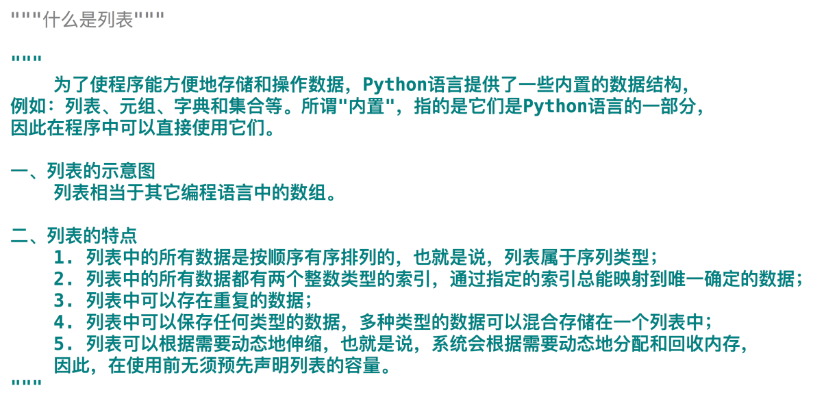

# Python基础语法--列表
### 什么是列表？

### 列表的两种创建方式

### 列表的查值方式
.png)
.png)
.png)
.png)
.png)
.png)
### 列表的改操作

### 列表的增操作
.png)
.png)
### 列表的删操作
.png)
.png)
.png)
.png)
### 列表的加乘法
.png)
.png)
### 列表的比较
.png)
.png)
### 列表的反转

### 列表的排序
.png)
.png)
### 多维列表
.png)
.png)