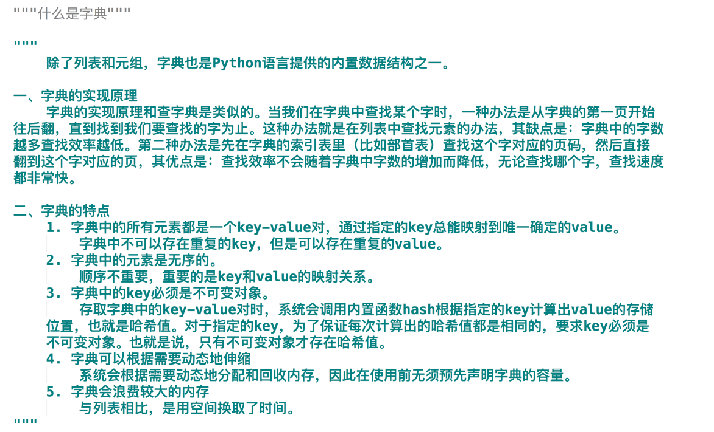
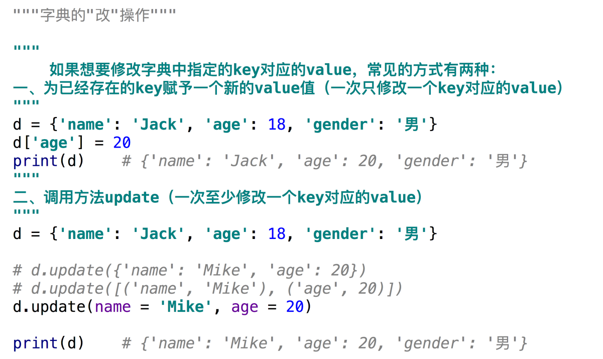
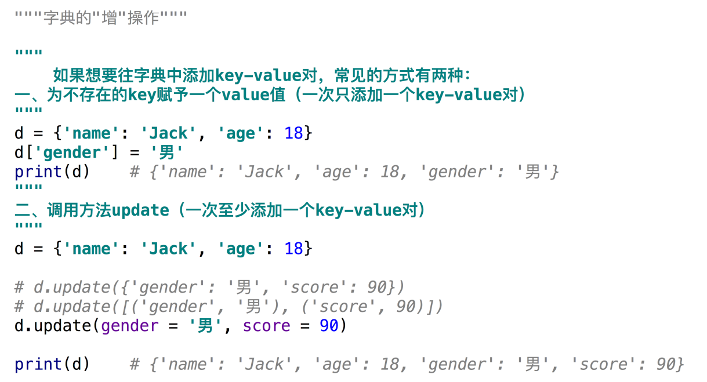
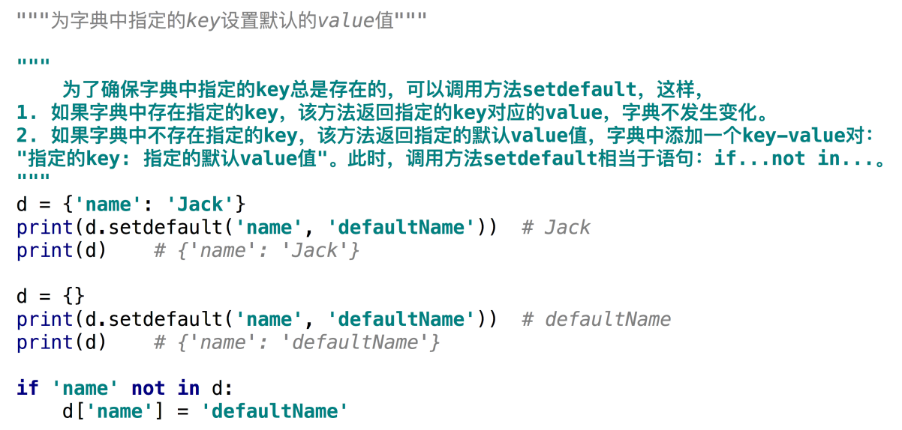

# Python基础语法--字典
### 为什么需要字典
.png)
.png)
### 什么是字典

### 字典的创建
.png)
.png)
### 字典的查操作
.png)
.png)
### 字典的改操作

### 字典的增操作

### 字典的删操作
.png)
.png)
### 为字典中的指定的key设置默认的value值

### 字典的视图
.png)
.png)
### 借助字典创建格式化字符串
.png)
.png)
