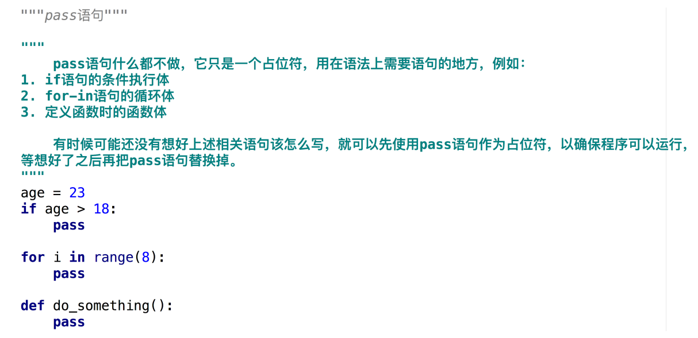

# Python基础语法--函数
### 函数的概述
.png)
.png)
### 函数的定义和调用
.png)
.png)
### 函数的调用之位置实参

### 函数的调用之关键字实参

### 函数的调用之实参的传递

### 函数的定义之多个返回值
.png)
.png)
### 函数的定义之带默认值的形参
.png)
.png)
.png)
### 函数的定义之使用'星号'定义关键字形

### 函数的定义之使用'星号'定义个数可变的位置形参
.png)
.png)
.png)
### 函数的调用之使用'星号'将序列中的每个元素都转换为位置实参
.png)
.png)
### 函数的定义之使用'双星'定义个数可变的关键字形参
.png)
.png)
### 函数的调用之使用'双星'将字典中的每个键值对都转换为关键字实参
.png)
.png)
### 函数的各种参数大总结

### pass语句

### 函数的定义之文档字符串
.png)
.png)
### 函数的定义之函数注解
.png)
.png)