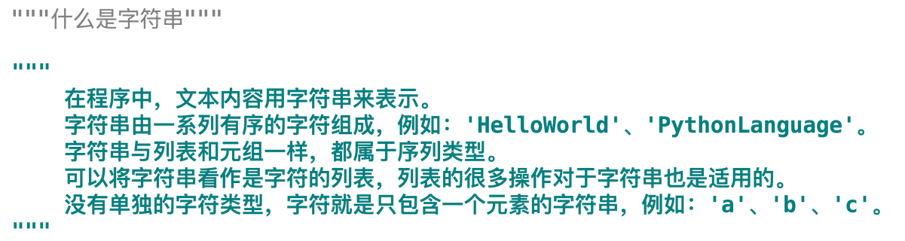
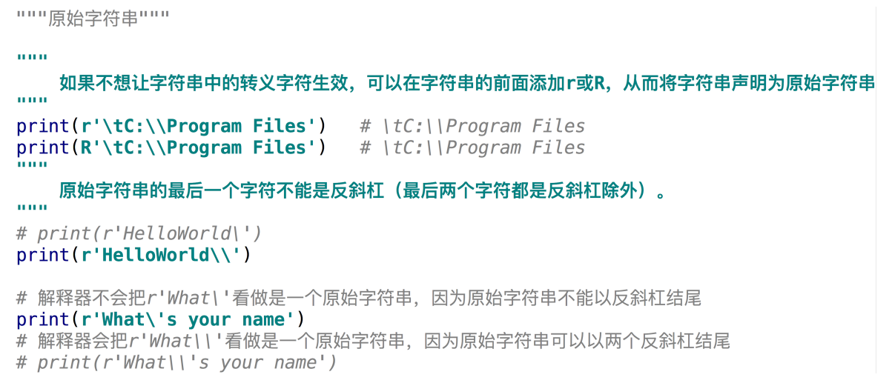
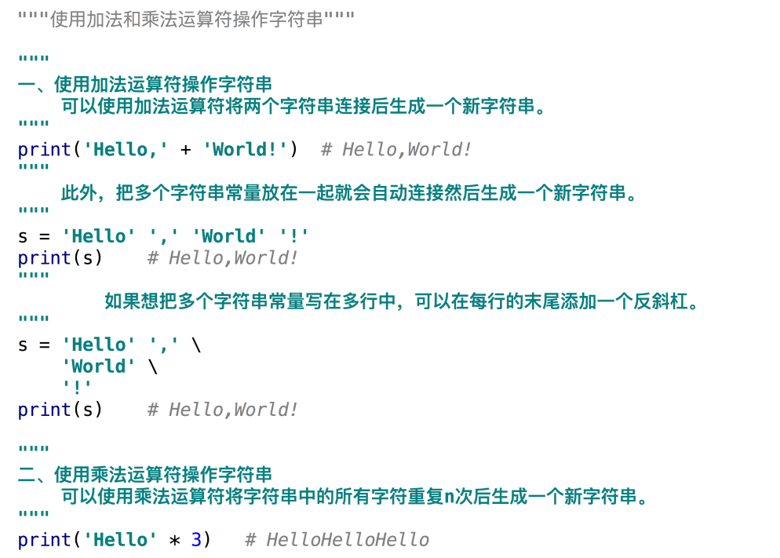
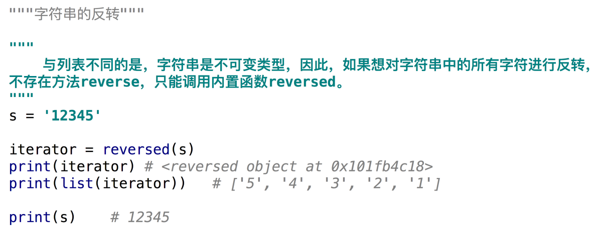
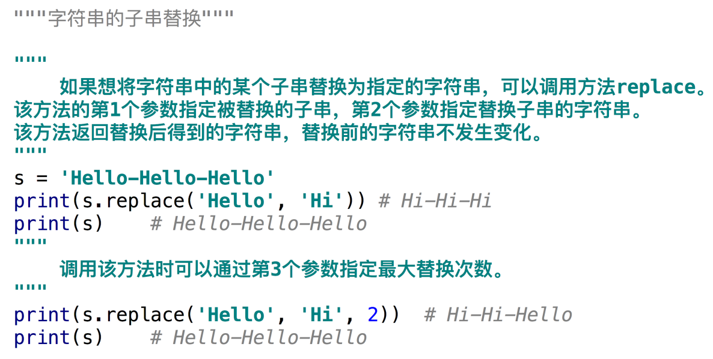
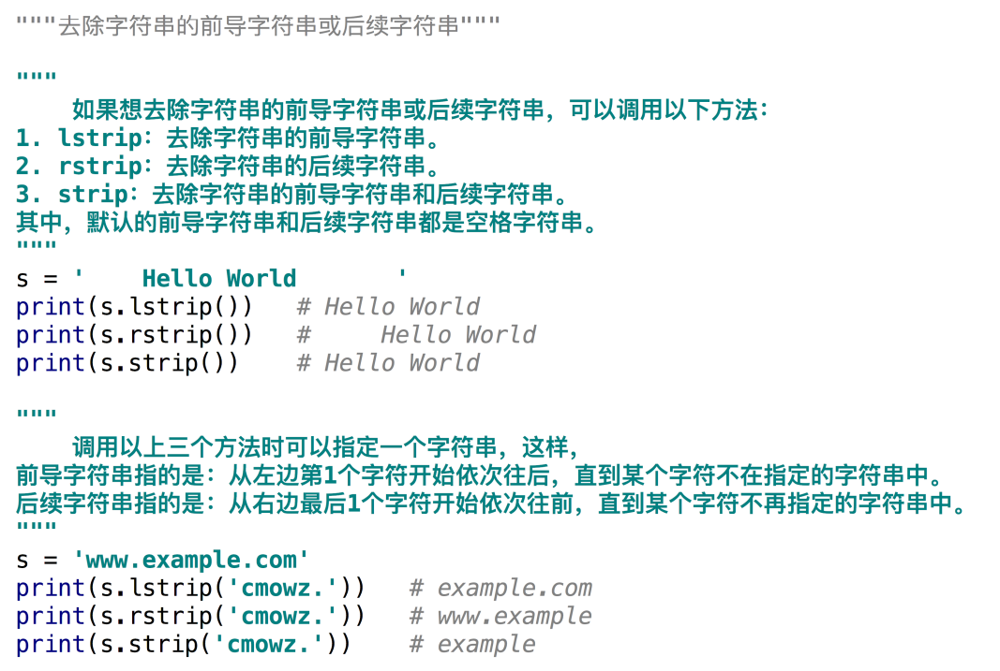

# Python基础语法--字符串
### 什么是字符串？

### 字符串的创建
.png)
.png)
.png)
### 转义字符
.png)
.png)
### 原始字符串

### 跨越多行的字符串
.png)
.png)
### 加法和乘法操作字符串

### 字符串查操作
.png)
.png)
### 字符串是不可变类型

### 比较运算符比较两个字符串
.png)
.png)
### 字符串的反转

### 字符串的排序
.png)
.png)
### 格式化字符串之使用百分号作为占位符
.png)
.png)
.png)
### 格式化字符串之使用花括号作为占位符
.png)
.png)
.png)
.png)
### 格式化字符串之使用美元符作为占位符
.png)
.png)
### 字符串大小写转换
.png)
.png)
### 字符串的对齐
.png)
.png)
### 字符串的子串替换

### 字符串的字符转换
.png)
.png)
### 字符串的劈分和合并
.png)
.png)
.png)
.png)
### 以is开头的字符串方法
.png)
.png)
### 去除字符串的前导字符串或后续字符串

