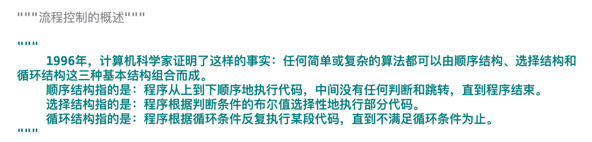
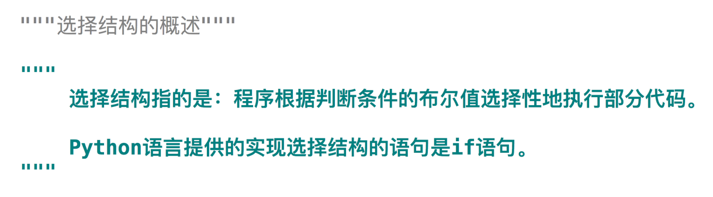
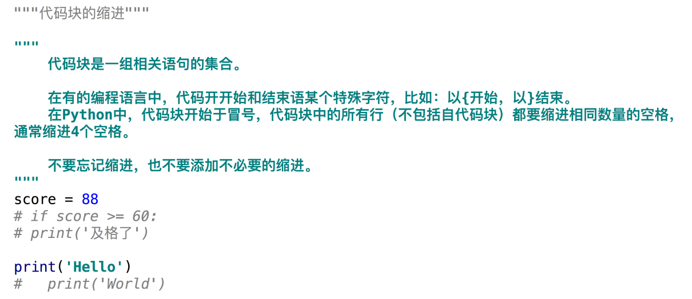
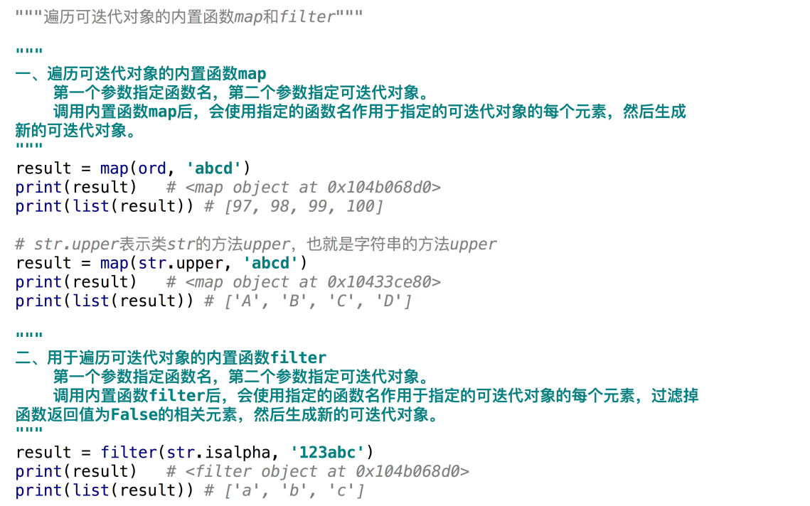

# Python基础语法--流程控制
### 流程控制的概述

### 顺序结构

### 选择结构的概述

### 代码的缩进

### if语句
.png)
.png)
.png)
.png)
### 对象的布尔值
.png)
.png)
.png)
### 条件表达式
.png)
.png)
### 循环结构的概述
.png)
.png)
### while语句
.png)
.png)
### for-in语句
.png)
.png)
.png)
### 带索引的序列遍历
.png)
.png)
### 循环语句中的break-else结构
.png)
.png)
### 循环语句中的break和continue
.png)
.png)
### 并行遍历
.png)
.png)
.png)
### 遍历可迭代对象的内置函数map和filter

