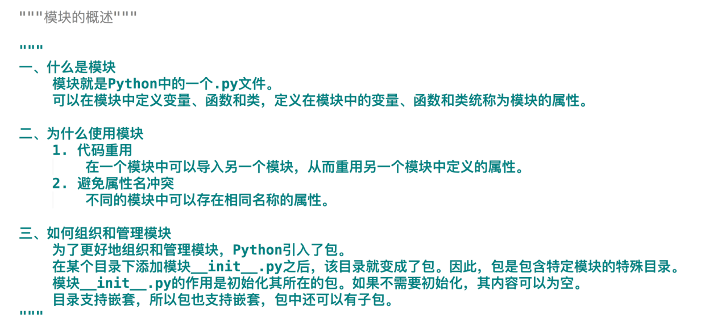
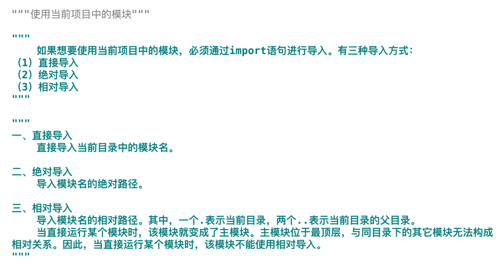
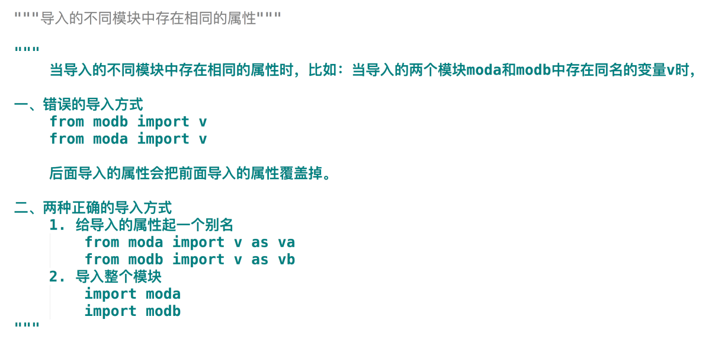
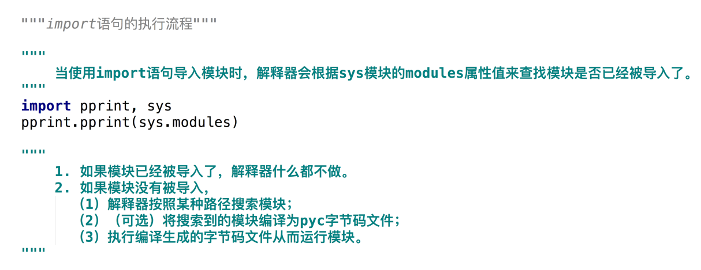
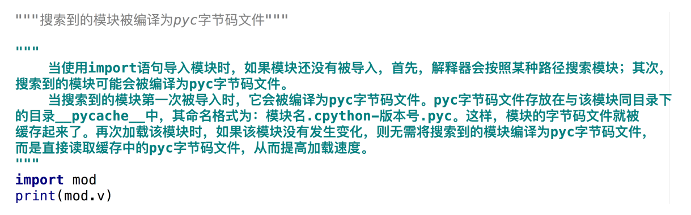
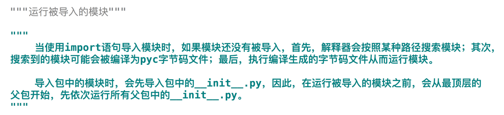
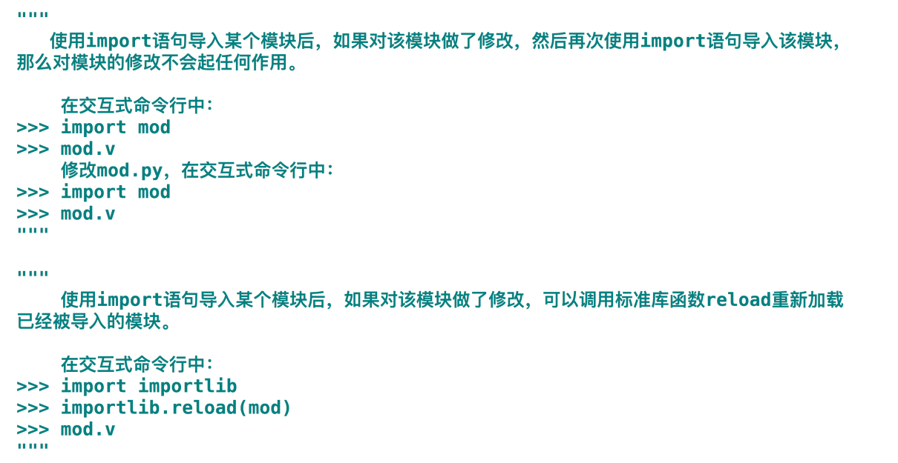
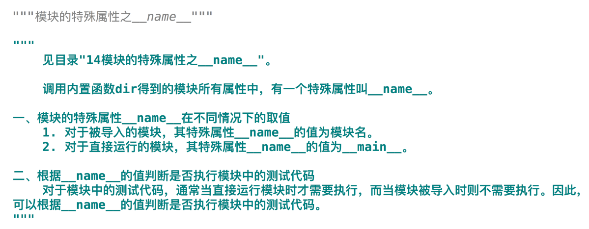
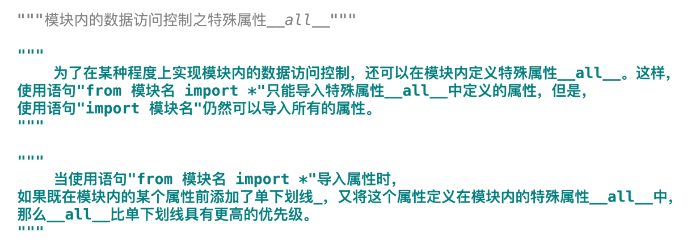

# Python高级语法--模块
### 模块的概述

### 使用标准库中的模块
.png)
.png)
.png)
.png)
.png)
.png)
### 使用第三方库中的模块
.png)
.png)
.png)
.png)
.png)
### 安装和配置Anaconda
.png)
.png)
### 使用当前目录的模块

### 导入的不同模块中存在相同的属性

### import语句的执行流程

### 解释器搜索模块的路径
.png)
.png)
.png)
### 搜索到的模块被编译为pyc字节码文件

### 运行被导入的模块

### 重新加载已经被导入的模块

### 调用内置函数dir查看模块的所有属性
.png)
.png)
### 模块的特殊属性之__doc__
.png)
.png)
### 模块的特殊属性之__name__

### 模块内的数据访问控制之单下划线

### 模块内的数据访问控制之特殊属性__all__
