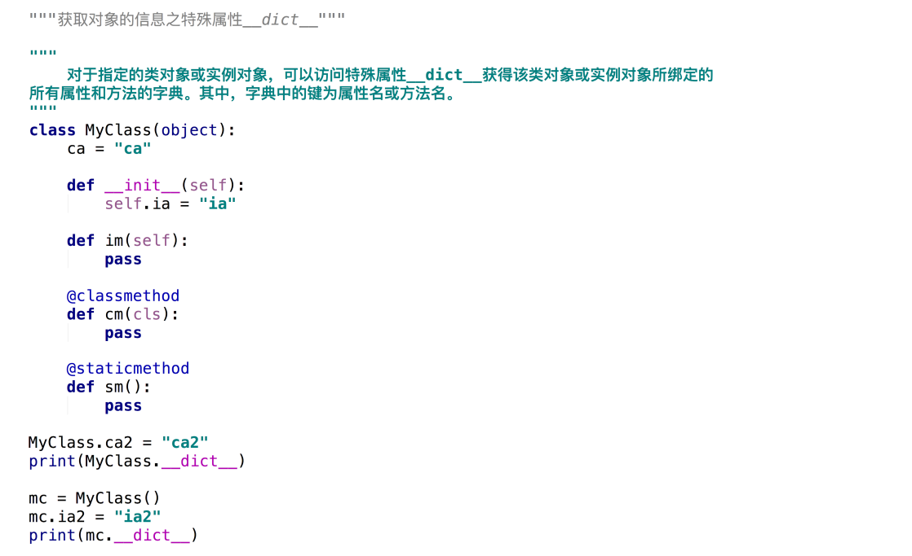

# Python高级语法--面向对象
### 面向对象的编程的概述
.png)
.png)
.png)
.png)
### 定义类对象和创建实例对象
.png)
.png)
.png)
.png)
### 实例属性
.png)
.png)
.png)
.png)
.png)
### 类属性
.png)
.png)
.png)
.png)
.png)
.png)
### 实例方法
.png)
.png)
.png)
.png)
### 类方法
.png)
.png)
.png)
### 静态方法
.png)
.png)
.png)
### 访问控制
.png)
.png)
.png)
### 封装
.png)
.png)
### 继承的概述
.png)
.png)
.png)
### 继承
.png)
.png)
.png)
### 重写
.png)
.png)
### 多态
.png)
.png)
### MRO
.png)
.png)
.png)
.png)
### 获取对象的信息之内置函数issubclass()和isinstance()
和isinstance()(1).png)
和isinstance()(2).png)
和isinstance()(3).png)
### 获取对象的信息之内置函数type()
(1).png)
(2).png)
(3).png)
### 获取对象的信息之内置函数dir()
.png)
### 特殊属性和特殊方法

### 获取对象的信息之特殊属性__dict__

### 获取对象的信息之反射
.png)
.png)
### 类对象的特殊方法之__len__()
(1).png)
(2).png)
### 类对象的特殊方法之__iter__()和__next__()
和__next__()(1).png)
和__next__()(2).png)
### 类对象的特殊方法之__add__()和__radd__()
和__radd__()(1).png)
和__radd__()(2).png)
### 类对象的特殊方法之__str__()和__repr__()
和__repr__()(1).png)
和__repr__()(2).png)
和__repr__()(3).png)
和__repr__()(4).png)
### 类对象的特殊方法之__new__()
(1).png)
(2).png)
### 对象的引用计数
.png)
.png)
.png)
.png)
### 类对象的特殊方法之__del__()
.png)
### 类对象的特殊方法之__getattr__()
(1).png)
(2).png)
### 类对象的特殊方法之__getitem__()
(1).png)
(2).png)
### 类对象的特殊方法之__call__()
.png)
### 类对象的特殊属性之__doc__

### 类对象的特殊属性之__slots__
.png)
.png)
.png)